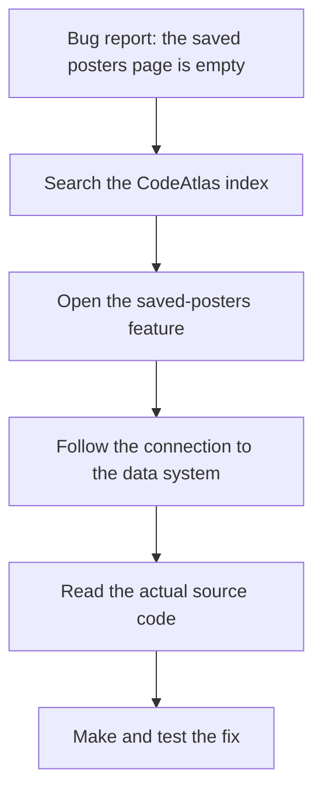

# CodeAtlas

**CodeAtlas looks at a software project and creates a map of what the project does,
where that behavior lives, and how the important parts connect — so developers and AI
coding agents can find the right code faster when fixing bugs or adding features.**

Private beta · v0.5.0 · not yet on npm

## The problem

A typical project has hundreds or thousands of files — but a bug report describes
behavior, not filenames:

> "The saved posters page is empty."

Searching for `poster` returns dozens of hits: components, tests, styles, generated
code. The relevant behavior usually spans several files, and the data-loading code is
easy to miss. Without a map, a developer (or an AI coding agent) greps for keywords,
inspects unrelated components, and follows imports by hand — and can still miss the
code that matters.

With CodeAtlas, you can start from the saved-posters feature, see which files belong
to it, and follow the connection to the data system. It helps narrow the search; it
does not replace reading, testing, or understanding the code.

## What CodeAtlas does

- Reads the project (read-only — your source files are never modified).
- Identifies important parts of the application: things a user can do (features) and
  shared capabilities used by several of them (systems).
- Groups related files around that functionality, separating real application
  behavior from tests, generated files, and incidental text.
- Records how the important parts connect.
- Writes everything into one `.codeatlas/` directory: machine-readable data plus
  readable Markdown documentation.
- Preserves uncertainty: where the available information is not enough, CodeAtlas
  says so instead of guessing.

## What the result looks like

```text
.codeatlas/
├── canonical/                  the map, as data (the source of truth)
│   ├── features.json           the application capabilities CodeAtlas identified
│   ├── systems.json            shared capabilities used by several features
│   ├── files.json              relevant source files and their roles
│   ├── relationships.json      connections between features, systems, and files
│   ├── unresolved.json         areas CodeAtlas could not confidently decide
│   └── canonical-report.json   per-run summary counts
├── markdown/                   the same map, readable
│   ├── INDEX.md                searchable starting point for exploring the map
│   ├── features/  systems/     one readable page per feature and system
│   ├── unresolved.md           the uncertain areas, with reasons
│   └── ARCHITECTURE.md         whole-map overview
└── …                           recorded working data from each analysis pass
                                (evidence/, annotation/, structural/, investigation/,
                                semantic/, consolidation/ — including
                                evidence/manifest.json, the collector's record of
                                what was scanned)
```

Every claim in the map carries its supporting information, and uncertain areas are
listed rather than hidden. `flows.json` is part of the data model but is not generated yet.

## Example: investigating a bug



Without the map, step 1 is a keyword search over the whole repository. With it, the
developer or AI agent starts from the feature, its files, and its connections — and
only then reads the source code that matters.

## Who it helps

- Developers joining an unfamiliar project.
- Developers fixing bugs or adding features.
- Maintainers documenting a codebase.
- AI coding agents that need a useful starting point instead of blind exploration.
- Teams that want a shared map of the application's important behavior.

## How it works

CodeAtlas performs several passes over the project: it collects information about
files and imports, identifies useful text and application behavior, then builds and
checks a map of related functionality. A few terms worth knowing:

- **Feature** — something the application lets a user do ("Save Poster").
- **System** — a shared capability used by multiple features ("Auth").
- **Relationship** — a recorded connection between important parts, backed by an
  observed import.
- **Evidence** — the information that supports why an item was identified.
- **Ambiguous / Unresolved** — an area where the available information was not
  sufficient for a confident decision; listed openly instead of guessed.

A map is an aid to investigation, not a substitute for reading source code. Deeper
detail: [docs/concepts.md](docs/concepts.md) (concepts and trust model) and
[docs/output-format.md](docs/output-format.md) (artifacts and analysis passes).

## Install and run

Node.js ≥ 18, no other requirements. **Not published on npm** — `npm install
codeatlas` and `npx codeatlas` **do not work yet**; install from a checkout:

```bash
git clone https://github.com/Prathamesh913/codeatlas.git
cd codeatlas
node bin/codeatlas.js <repository-path>            # writes <repository-path>/.codeatlas
# or choose another output location:
node bin/codeatlas.js <repository-path> --output ./map
```

A successful run prints its progress and a summary, for example (a small React test
project):

```text
codeatlas: done — 2 features, 0 systems, 0 ambiguous, 0 unresolved/demoted
codeatlas: output written to /tmp/map
```

`<repository-path>` is the directory of the project to map. The bare `codeatlas`
command (`codeatlas <repository-path> [--output <directory>]`, plus `--help` and
`--version`) comes from a tarball install; from a checkout use `node bin/codeatlas.js`.
See [docs/installation.md](docs/installation.md) and
[docs/uninstallation.md](docs/uninstallation.md).

## Post-fix evaluation

To check a generated map — counts, reverse-index integrity, router handling,
suspicious patterns — without touching the analyzed repository:

```bash
node bin/codeatlas-evaluate.js <repository-path> --output ./eval-my-app
node bin/codeatlas-evaluate.js <repository-path> --output ./eval-my-app --rerun
```

Exit `0` = all integrity checks pass, `2` = failures found (reports still
written), `1` = usage/runtime error. Share back
`evaluation/evaluation-summary.json` and `evaluation-report.md`. Details:
[docs/evaluation.md](docs/evaluation.md).

## What to expect

- **Private beta.** Validated on two real repositories so far; unfamiliar-repository
  testing is still in progress.
- Results are useful guidance, not a guaranteed complete understanding. Names and
  groupings can be imperfect; check the recorded confidence before acting.
- Some areas may remain ambiguous or unresolved — intentionally, rather than guessed.
- Strongest on JavaScript/TypeScript and Python; other languages produce sparse maps.
- `flows.json` is not currently generated.
- No npm package and no stable public release yet.

## Privacy and safety

CodeAtlas reads the target repository and writes generated output to `.codeatlas/`
(or your `--output` directory). Source files are never modified, and there is no
network access or telemetry. When reporting issues, do not submit private source
code, secrets, credentials, or sensitive logs — see
[SECURITY.md](SECURITY.md).

## Contributing

Contributions and private-beta feedback are welcome — see
[CONTRIBUTING.md](CONTRIBUTING.md), the
[issue templates](.github/ISSUE_TEMPLATE/bug_report.yml), and
[docs/private-beta.md](docs/private-beta.md).

## License and project status

MIT — see [LICENSE](LICENSE). The license choice is **provisional** and still requires
owner confirmation before public release. Current status, and what is completed vs
pending vs blocked: [docs/release-readiness.md](docs/release-readiness.md).

## Roadmap

1. Private-beta testing with real users and repositories.
2. Feedback from unfamiliar repositories.
3. Improvements based on real usage.
4. Packaging and release decisions.
5. Future improvements (flow generation, accuracy) only where feedback names a
   concrete problem.

More: [CHANGELOG.md](CHANGELOG.md) · [DECISIONS.md](DECISIONS.md) ·
[examples/](examples/) · [SKILL.md](SKILL.md) (rules for AI agents consuming the map).
